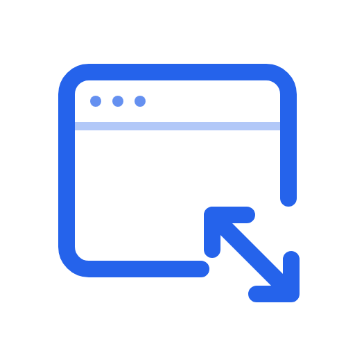
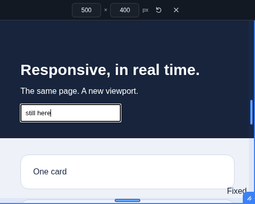

<p align="center">
  
</p>

<h1 align="center">Quickview</h1>

<p align="center">
  <em>Resize the viewport. Keep your browser window.</em>
</p>

<p align="center">
  
  
  
  
  <a href="LICENSE"></a>
</p>

<p align="center">
  <strong>Real viewport resizing &middot; No window resizing &middot; No page reload &middot; No runtime dependencies</strong>
</p>

<p align="center">
  Quickview is a Chrome extension for checking responsive layouts on the page you are already using.
  Drag the right edge, bottom edge or corner, or enter exact dimensions in the fixed control strip.
  The site stays in its original tab, with its current state intact.
</p>

---

<p align="center">
  
</p>

## Install

1. Download or clone this repository.
2. Open `chrome://extensions`.
3. Enable **Developer mode**.
4. Click **Load unpacked** and select the repository folder containing `manifest.json`.
5. Pin **Quickview** from the browser's extensions menu.

No npm installation, build step or server is needed to use the extension. The extension controls are currently in Italian.

To update an unpacked installation, click **Reload** on Quickview in `chrome://extensions`, then reload the page before activating it again.

## Use

1. Open a website and click the **Quickview** icon.
2. Drag the right edge to change width, the bottom edge to change height, or the bottom-right corner to change both.
3. For an exact size, enter the width and height in the control strip and press **Enter**.
4. Use the reset button to restore the original size while keeping the handles active.
5. Click the extension icon again, press **Esc**, or use the **×** button to close Quickview and restore the normal viewport.

The controls sit in a fixed, 40-pixel strip at the top. Quickview reserves space above the site and adjusts top-anchored fixed and sticky elements so the controls can stay in place while you navigate. Closing Quickview removes the added styles and restores the original positions.

The resize handles also support the keyboard: focus one with **Tab**, then use the arrow keys. Hold **Shift** for 10-pixel steps.

### Size limits

Dimensions are CSS pixels. Width and height cannot exceed the native tab space measured when Quickview is activated. Dragging, keyboard controls and typed values all respect this limit; oversized values are clamped. The minimum is **240 × 180**, or the available space if the tab is smaller. The page stays at 100% scale.

The control strip is part of the page viewport, so its 40 pixels are included in the displayed height. It is not a separate native browser header.

If you resize the browser window, turn Quickview off and back on to measure the available space again.

## How it works

Quickview uses [`chrome.debugger`](https://developer.chrome.com/docs/extensions/reference/api/debugger) and [`Emulation.setDeviceMetricsOverride`](https://chromedevtools.github.io/devtools-protocol/tot/Emulation/#method-setDeviceMetricsOverride) to change the real page viewport. Media queries, `vw`, `vh`, and `window.innerWidth` / `window.innerHeight` respond to the selected dimensions.

The extension does not resize the browser window, reload the page during activation or resizing, wrap the site in an iframe, or replace its content. Dimensions and handles stay active through reloads and navigation in the same tab. Scrolling, typing and focusing fields preserve the chosen viewport.

Chrome displays a debugging banner while Quickview is active. It can reduce the available tab height. Cancelling debugging restores the native viewport, and Quickview's controls disappear within about six seconds.

### Compatibility and limitations

- Works on HTTP and HTTPS pages, including `localhost`.
- For local files, enable **Allow access to file URLs** in the extension details.
- Internal pages such as `chrome://`, the Chrome Web Store and other protected pages cannot be modified. Errors show a **!** badge; hover over the icon to read the message.
- DevTools or another debugger can interrupt Quickview. Close them and activate it again.
- This checks desktop responsive layout. It does not emulate a mobile user agent, touch input or device hardware.
- The reserved header space changes the page's top spacing while Quickview is active.

### Privacy

Quickview does not use external services, collect telemetry or transmit page data. Active tab state is stored only in the browser session. The README's badges are hosted by Shields.io; the installed extension makes no requests to that service.

## Development

Use Node.js 24 for the development tools. Dependencies are for tests and artwork generation only.

```sh
npm ci
PLAYWRIGHT_BROWSERS_PATH=0 npx playwright install chromium
npm test
```

On Linux, add `--with-deps` to the browser installation command if system dependencies are missing.

The nine browser tests load the actual extension and cover resizing, native size limits, media queries, viewport units, state preservation, navigation, independent tabs, keyboard controls, the fixed strip, site header offsets, style restoration and debugger cancellation. They also check clicks, typing, scrolling and offscreen input focus, including the rendered pixels.

Tests use temporary browser profiles and remove them afterward. The automation hides Chrome's debugging banner to keep the test viewport stable. Fixtures forbid iframe embedding, inline styles and HTML sinks through CSP and Trusted Types.

To run the same tests with a locally installed Brave browser:

```sh
QUICKVIEW_BROWSER=/path/to/brave npm test
```

The [GitHub Actions workflow](.github/workflows/test.yml) runs the Chromium suite on pushes and pull requests.

### Artwork

All artwork lives in `assets/`. Each logo has a square canvas and is available as SVG and 512 × 512 PNG:

| Variant | SVG | PNG |
| --- | --- | --- |
| Blue mark, transparent background | [SVG](assets/logo-mark.svg) | [PNG](assets/logo-mark.png) |
| Light background | [SVG](assets/logo-light.svg) | [PNG](assets/logo-light.png) |
| Dark background | [SVG](assets/logo-dark.svg) | [PNG](assets/logo-dark.png) |

The source mark is [`assets/logo-mark.svg`](assets/logo-mark.svg). To regenerate the background variants and extension icons after editing it:

```sh
npm run icons
```

The generator uses the installed Playwright Chromium browser. Generated PNG assets are included in the repository, so users do not need to run it.

### Project files

| Path | Purpose |
| --- | --- |
| `manifest.json` | Manifest V3 configuration and permissions |
| `background.js` | Debugger session, tab state and viewport size limits |
| `controller.js` | Control strip, resize handles and reversible page spacing |
| `assets/icons/` | Extension icons at Chrome's required sizes |
| `assets/` | Transparent, light and dark logos, vector source and preview |
| `tests/extension.test.mjs` | Browser integration tests |
| `scripts/generate-icons.mjs` | Artwork generation |

See [CONTRIBUTING.md](CONTRIBUTING.md) for the development conventions.

## License

Quickview is released under the [MIT License](LICENSE).

Copyright (c) 2026 Vincenzo Petrucci.
